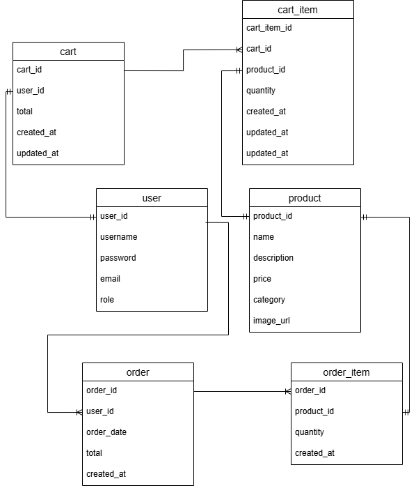

# 🛒 Spring Boot E-Commerce Backend

A **Sp ring Boot e-commerce backend** featuring JWT authentication, a product catalog, shopping cart, order management, and user roles. The application uses **PostgreSQL** as the database and is fully **Dockerized** for easy setup.

---

## 🚀 Features

- User authentication & authorization with JWT  
- User roles: Admin & Customer  
- Product catalog: CRUD operations and image upload  
- Shopping cart: Add, update, remove items  
- Order management: Place orders and view order history  
- PostgreSQL database with **sample data**  
- Fully Dockerized for quick setup  
- Postman collection available for easy API testing  

---

## 🗂 Database Schema

Here is the **database schema** showing all entities and relationships (users, products, cart, orders, etc.).  


---

## 🐳 Running the Project

Requirements:
- Docker & Docker Compose installed

Steps:
```bash
git clone https://github.com/willpand/springboot-ecommerce.git
cd ecommerce-backend
mvn clean package -DskipTests
docker-compose up --build
```

- Backend runs at `http://localhost:8080`  
- PostgreSQL is running inside Docker (`db:5432`)  
- Sample data (products, users) is preloaded

---

## 📦 API Testing (Postman)

You can import the **Postman collection** from:  
[Postman Collection Download Link](./postman-collection.json)  

> **Important:** For endpoints that require authentication, **log in first** using `/api/auth/login`. The JWT token will be automatically stored in the Postman environment variable. After that, you can test the other secured endpoints.

### Summary of Main Endpoints

| Controller | Endpoint | Purpose |
|------------|---------|---------|
| Auth | `/api/auth/register` | Register a new user |
| Auth | `/api/auth/register-admin` | Register a new admin |
| Auth | `/api/auth/login` | Login & get JWT token |
| Cart | `/api/cart` | View user cart |
| Cart | `/api/cart/add` | Add an item to cart |
| Products | `/api/products` | List all products |
| Products | `/api/products/{id}` | Get product by ID |
| Products | `/api/products/{id}/upload-image` | Upload image for product |
| Orders | `/api/orders` | View orders |
| Orders | `/api/orders/place` | Place a new order |

---

## ⚙ Environment & Configuration

Docker Compose handles all environment variables:

| Variable | Value |
|----------|-------|
| `SPRING_DATASOURCE_URL` | `jdbc:postgresql://db:5432/ecommerce` |
| `SPRING_DATASOURCE_USERNAME` | `postgres` |
| `SPRING_DATASOURCE_PASSWORD` | `1234` |
| `SPRING_JPA_HIBERNATE_DDL_AUTO` | `create-drop` |
| `SPRING_JPA_SHOW_SQL` | `true` |

All configuration is set in `application.properties`.

---

## 📂 Project Structure

```
ecommerce-backend/
├── src/main/java/com/william/ecommerce/   # Spring Boot code
├── src/main/resources/
│   ├── application.properties
│   ├── data.sql
├── Dockerfile
├── docker-compose.yml
├── db-schema.pdf
├── postman-collection.json
├── pom.xml
└── README.md
```

---

## ✅ Notes

- This project is primarily for **learning and showcasing backend/API development in Java**  
- Everything runs locally via Docker  
- Already contains **sample data**, so you can test immediately

---

## 📄 License

MIT License

